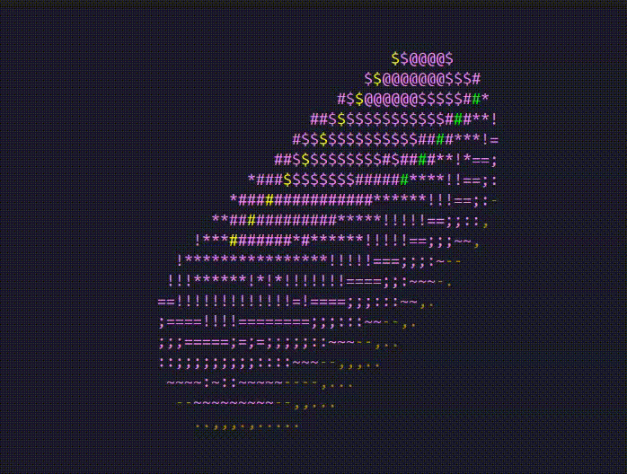

# Spinning Objects

A zero-dependency, cross-platform 3D rendering engine built entirely from scratch in C++ that consists of a collection of Spinning Objects.

This project renders 3D mathematical geometries directly into the terminal using ASCII characters. Instead of relying on standard C++ libraries (like `<cmath>`), the engine features a custom-built, lightweight mathematics library utilising Taylor Series expansions to calculate trigonometric functions and 3D projection matrices in real-time.

## Features
* **Zero-Dependency Math:** Custom implementations of Sine, Cosine, absolute value and floating-point modulo without standard library overhead
* **Z-Buffering (Depth Sorting):** Implements a custom 1D Z-buffer to accurately calculate depth (One-Over-Z) and prevent overlapping geometric faces from rendering incorrectly
* **Surface Normal Luminance:** Calculates the dot product between a directional light source and the geometry's surface normals to generate dynamic ASCII shading (`.,-~:;=!*#$@`)
* **Cross-Platform Execution:** Utilises OS-level preprocessor directives to ensure smooth, consistent animation loops across Linux, macOS and Windows without relying on `<thread>` or `<chrono>`
* **ANSI Screen-Space Texturing:** Applies dynamic terminal coloring mapped to luminance values for stylised rendering

## Engine Architecture
To support a increasingly growing library of geometry for different types of spinning objects, the engine utilises OOP.

* `Shape.h`: An abstract base class enforcing a strict `drawToBuffer` interface.
* `Torus.cpp`: A derived class that entirely encapsulates the 3D mathematical geometry and rotation matrices for the donut
* `rendered.cpp`: The core engine loop. It remains decoupled from the geometry and just passes in the Z-buffer and frame buffer to the active shape before applying the ANSI colour mapping and pushing to std out.

## Spinning Objects Library
* **Torus:** A classic 3D donut (torus) featuring dynamic pink frosting and animated sprinkles
* *(Upcoming)* 3D Cube
* *(Upcoming)* 3D Cylinder
* *(Upcoming)* 3D Pyramid

## Build and Run
This project uses a standard Makefile for simple compilation

**Prerequisites:** A C++17 compatible compiler (e.g., `g++`) and `make`
1. Clone the repository:
   `git clone https://github.com/T-Kalv/spinning-objects.git`
2. Navigate to the directory and compile:
   `cd spinning-objects-library`
   `make`
3. Maximize your terminal window and run:
   `./spinningObjects`

## Acknowledgements
Mathematical inspiration taken from Andy Sloane's original donut.c
